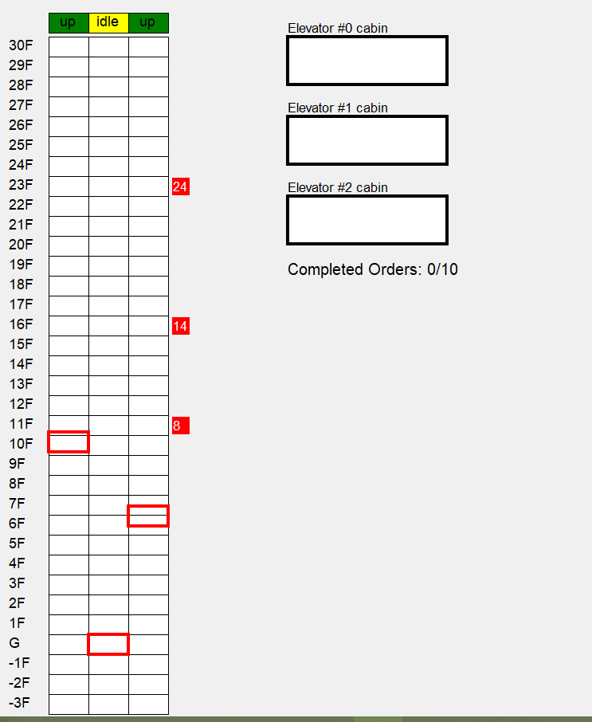

# ElevatorSimulator 
This is my final project for Syracuse University course CSE691 Multi-threading/Parallel Programming. The simulation runs according to the parameters defined in [sim.py]((./sim.py)). Elevators will run individually, pickup/let off orders randomly generated on different floors. After a certain number of orders are completed, it gives several kinds of metric statistics based on overall performance.  

# SCAN Algorithm
The elevator continues to travel in its current direction (up or down) until empty, stopping only to let individuals off or to pick up new individuals heading in the same direction.

# Run 
```shell
python sim.py
```

# Configuration
All parameters are listed on the top of [sim.py]((./sim.py))  

| Name        | Description           |
| ------------- |-------------|
|  MAX_FLOOR     | Number of floors above ground floor |
| MIN_FLOOR    | Min floor level (for example: -5) |
|NUM_ELEVATOR| Number of elevators  |
|NUM_ORDER| Total number of orders/requests in the simulator |
|ELEVATOR_MOVE_INTERVAL | Time(second) interval between elevators moves by one pixel. It defines how fast an elevator moves. |
|LOADING_UNLOADING_TIME| Time(second) needed to load or unload a passenger. It defines how fast an elevator load/unload an order |
|ORDER_GENERATE_INTERVAL| Time(second) interval of order generation. It defines how fast orders are generated. |

# Demo Screenshots
