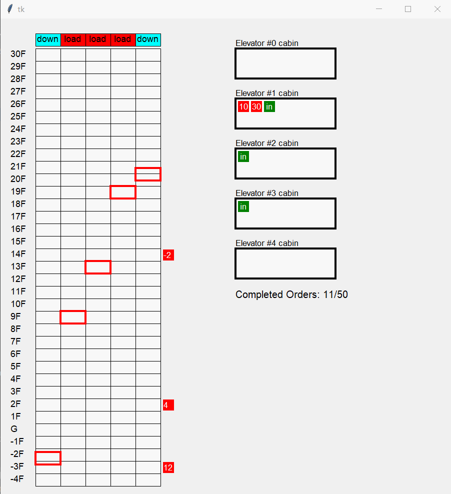

# ElevatorSimulator 
This is my final project for Syracuse University course CSE691 Multi-threading/Parallel Programming. The simulation runs according to the parameters defined by user. [Elevators](#elevator) will run individually, load/unload [orders](#order) randomly generated on different floors. After a certain number of orders are completed, it gives several kinds of metric statistics based on overall performance.  

# SCAN Algorithm
The elevator continues to travel in its current direction (up or down) until empty, stopping only to let individuals off or to pick up new individuals heading in the same direction.

# Compile
using Developer Command Prompt for VS 2019
```shell
cl /EHsc server.cpp
```
This will generate `server.exe` where simulation runs. `simulator.py` is just a frontend and control. 

# Run 
Please make sure `server.cpp` is compiled and `server.exe` is put under the working directory.
```shell
python simulator.py
```

# Configuration
All parameters are listed on the top of [sim.py]((./sim.py))  

| Name        | Description           |
| ------------- |-------------|
|  MAX_FLOOR     | Number of floors above ground floor |
| MIN_FLOOR    | Min floor level (for example: -5) |
|NUM_ELEVATOR| Number of elevators  |
|ELEVATOR_CAPACITY| Elevator cabin capacity. It defines how many orders it can carry. |
|NUM_ORDER| Total number of orders/requests in the simulator |
|LOADING_UNLOADING_TIME(MS)| Time(millisecond) needed to load or unload a passenger. It defines how fast an elevator load/unload an order |
|ORDER_GENERATE_INTERVAL(MS)| Time(millisecond) interval of order generation. It defines how fast orders are generated. |

# Demo Screenshots
  
  
  


# Design
## Entity Definition
### Elevator
An elevator moves vertically and carries orders to their destination floors. 
### Order 
It represents one person's elevator request. It contains which floor the person is on and which floor he wants to go to.

## Multi-threading Design
### Processes
The simulator is split into 2 programs.
* `server.exe` Implemented in `C++` (Professor's requirement). It handles the whole simulation using multi-threading.
* `simulator.py` A frontend program used to put in parameters and demonstrate the progress of simulation (single-threaded).

### Threads
C++ standard threading library is used and several threads are defined.
* Main thread is used for UI. It draws text or shapes based on current simulation progress.
* One thread per elevator. It moves the elevator and load/unload orders.
* One thread for order generator. It generates random orders per `ORDER_GENERATE_INTERVAL` seconds.
* One thread for order scheduling. It distribute orders to a elevator.  

Total number of threads = 3 + `NUM_ELEVATORS` 

### Shared resources
* Waiting Orders  
Each floor has an array to keep those waiting orders (generated but not picked up by an elevator). Apparently this will have a race condition between elevator threads and order generator thread. So each floor has a lock to protect this. 
* Metric Stats Counters
Counters are updated simultaneously by all elevator threads. A lock is used to protect these counters.
